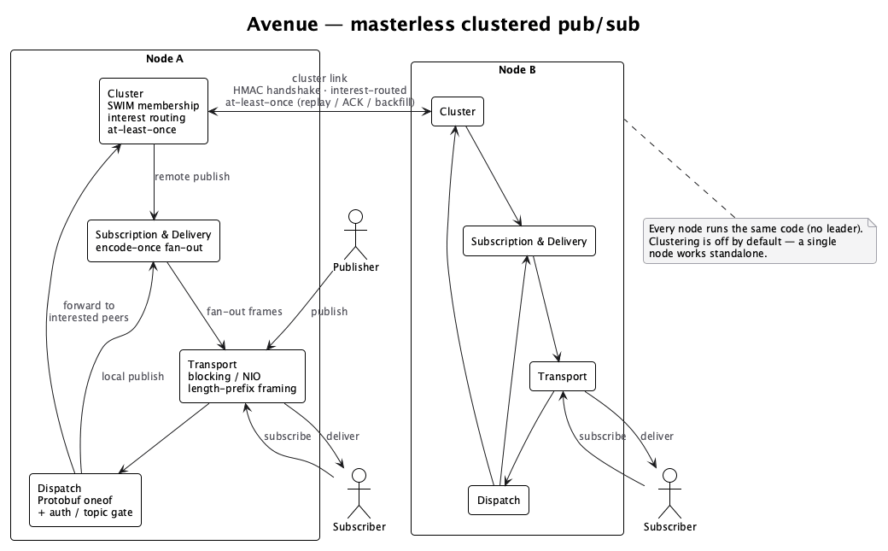

# Avenue

Avenue is a **high-performance, masterless, clustered TCP pub/sub broker** written in Java 21.
It started as a single-node experiment and grew into a small but complete messaging system:
a binary Protobuf wire protocol, a peer-to-peer cluster with gossip membership and at-least-once
delivery, and a hot path tuned with profiling.

> **Status.** This is a from-scratch engineering project, not a hardened production deployment.
> It is, however, functionally complete and thoroughly tested (96 automated tests, including
> end-to-end, cluster, partition/heal and chaos-soak scenarios). The known limits are documented
> honestly below and in [`docs/`](docs/).

---

## Features

**Core pub/sub**
- Topic-based publish/subscribe over TCP with length-prefixed framing.
- Binary **Protobuf** wire protocol (`ClientEnvelope` / `ClusterEnvelope`, oneof dispatch) — see
  [`docs/protocol.md`](docs/protocol.md).
- Token-based client authentication; optional **TLS** on the client port.
- Per-client bounded outbound queue with a configurable backpressure policy
  (`DISCONNECT_SLOW_CONSUMER` / `DROP_MESSAGE`), idle-timeout reaping and a max-connection limit.
- Opportunistic **write-batching** (coalesce many frames into one flush) on both client and cluster
  writers.
- Two transports behind one switch (`server.io-mode`): **blocking** thread-per-connection
  (virtual threads, default) or a hand-rolled **NIO selector event loop** for high connection counts.

**Masterless cluster** (off by default — see [`docs/clustering.md`](docs/clustering.md))
- **No coordinator / no leader.** Every node runs the same code and forms a full mesh of
  authenticated peer links.
- **SWIM gossip membership**: dynamic join/leave over seeds, indirect failure detection,
  incarnation-based refute, graceful leave.
- **At-least-once delivery**: per-target replay buffer, cumulative ACKs, reconnect backfill and an
  explicit bounded gap signal — surviving link drops, partitions and reconnects with end-to-end
  de-duplication.
- **Interest-based routing**: a publish is forwarded only to nodes that actually have a subscriber
  for that topic (delta propagation + anti-entropy full-state sync).
- **HMAC-SHA-256 challenge-response** node authentication (the shared secret never travels the wire);
  optional TLS on the cluster transport.

**Operability**
- Lightweight in-process metrics (`AvenueMetrics` / `ClusterMetrics`, no external dependency).
- Optional read-only **admin HTTP** introspection (`/health`, `/metrics`, `/metrics/prometheus`,
  `/cluster/members`, `/cluster/routing`, `/cluster/peers`), loopback-bound by default.
- Structured cluster event logs (`de.kyle.avenue.cluster.events`, `key=value`).

---

## Modules

| Module | What it is |
| --- | --- |
| `avenue-server` | The broker: transport, protocol, handlers, subscription/delivery, cluster, metrics, admin. |
| `avenue-api`    | The Java client SDK (`AvenueClient`, `TopicListener`, `@Topic`, `Message`). Depends on `avenue-server`. |

Requirements: **Java 21** (uses virtual threads), **Maven**. Protobuf code is generated at build time
via the `protobuf-maven-plugin` (no system `protoc` needed).

---

## Quick start

### Build & test

```bash
export JAVA_HOME=/path/to/jdk-21
mvn clean test
```

### Run a single node

The server reads `avenue-server/src/main/resources/default.properties`, overridable via a
`config/*.properties` file, matching `UPPER_SNAKE_CASE` environment variables, or a `.env` file.
At minimum set the authentication secret/token:

```bash
# .env (or environment)
AUTHENTICATION_SECRET=change-me
AUTHENTICATION_TOKEN=change-me-too
```

```bash
mvn -q -pl avenue-server exec:java -Dexec.mainClass=de.kyle.avenue.AvenueApplication
```

The node binds the client port (`server.port`, default `4180`). Clustering stays **off** unless
`cluster.enabled=true`.

### Client SDK example

```java
import de.kyle.avenue.AvenueClient;
import de.kyle.avenue.message.Message;
import de.kyle.avenue.topic.Topic;
import de.kyle.avenue.topic.TopicListener;

public class Main {
    public static void main(String[] args) throws Exception {
        AvenueClient client = AvenueClient.getInstance();

        // The @Topic annotation selects the subscription; a Subscribe is sent to the server
        // automatically once authenticated.
        client.registerTopicListener(new TopicListener() {
            @Override
            @Topic("test-topic")
            public void onMessage(Message message) {
                System.out.println("From " + message.source() + ": " + message.data());
            }
        });

        client.sendMessage("test-topic", "hello avenue");
    }
}
```

The client is configured the same way as the server (e.g. `AUTHENTICATION_SECRET`,
`SERVER_HOSTNAME`, `SERVER_PORT`, `CLIENT_NAME`); it exchanges the secret for a token and then
publishes/subscribes.

### Run a cluster (two nodes, local)

```properties
# node A — config/node-a.properties
cluster.enabled=true
cluster.node-id=node-a
cluster.port=7100
cluster.secret=shared-cluster-secret
cluster.peers=127.0.0.1:7101
server.port=4180
```

```properties
# node B — config/node-b.properties
cluster.enabled=true
cluster.node-id=node-b
cluster.port=7101
cluster.secret=shared-cluster-secret
cluster.peers=127.0.0.1:7100
server.port=4181
```

`cluster.peers` is a **seed** list for bootstrap; SWIM then discovers the full membership. A publish
on either node reaches interested subscribers on both. See [`docs/clustering.md`](docs/clustering.md)
for the full design, all `cluster.*` keys and the admin endpoints.

---

## Configuration

All keys, defaults and explanations live in
[`avenue-server/src/main/resources/default.properties`](avenue-server/src/main/resources/default.properties).
Highlights:

| Key | Default | Meaning |
| --- | --- | --- |
| `server.port` | `4180` | Client-facing TCP port. |
| `server.io-mode` | `blocking` | `blocking` (thread-per-connection) or `nio` (selector event loop). |
| `server.tls.enabled` | `false` | TLS on the client port (PKCS12 keystore). |
| `server.backpressure.policy` | `DISCONNECT_SLOW_CONSUMER` | Slow-consumer handling. |
| `server.batch.max-frames` | `64` | Write-coalescing batch size (`1` = flush per frame). |
| `cluster.enabled` | `false` | Master switch for cluster mode. |
| `cluster.node-id` | *(required when enabled)* | Stable node identity. |
| `cluster.secret` | *(empty)* | Shared HMAC secret for the peer handshake. |
| `admin.http.enabled` | `false` | Read-only introspection endpoint (loopback). |

---

## Performance

Numbers are **indicative**, measured on an Apple-Silicon laptop over loopback with a separate-process
load generator — see [`docs/perf-baseline.md`](docs/perf-baseline.md) for methodology and the full
table.

- **North-star metric** (the only Redis-comparable one): 1 publisher → 1 subscriber, ~100-byte
  messages, throughput at a latency bound. Avenue sustains **~250k msg/s** at **p99 ≈ 0.1 ms** on a
  single connection; service latency stays well under a millisecond far below saturation.
- The protocol was tuned profile-first: **Protobuf** roughly halved the wire size (−46 % client /
  −53 % cluster) and lifted throughput ~45 % over the original JSON; **write-batching** ~3× the
  single-node delivery throughput; payload-as-`bytes` removed ~40 % of server CPU spent on UTF-8
  transcoding; a builder-free outbound encoder removed the per-message allocation graph; the optional
  **NIO** transport eliminates the reader→writer thread-hop overhead entirely (JFR-verified).
- **Honest ceiling.** On a single machine the wall-clock throughput (~250–300k msg/s) is bounded by
  the shared CPU/loopback of load generator **and** server, not by the server. Validating the path to
  ~1M msg/s requires a second machine driving load over the network.

---

## Documentation

| Doc | Contents |
| --- | --- |
| [`docs/protocol.md`](docs/protocol.md) | Wire format: length-prefix framing + Protobuf envelopes, message types, versioning rules. |
| [`docs/clustering.md`](docs/clustering.md) | SWIM membership, at-least-once delivery, interest routing, consistency guarantees, all config keys, admin endpoints. |
| [`docs/security.md`](docs/security.md) | Auth model, HMAC cluster handshake, TLS, known limitations. |
| [`docs/perf-baseline.md`](docs/perf-baseline.md) | Benchmark methodology, north-star metric and the profile-guided optimization log. |

---

## Testing & benchmarks

```bash
# Full test suite (unit + integration + cluster + chaos invariants)
mvn clean test

# Throughput / latency load harness (plain main classes, not part of mvn test)
mvn -q -pl avenue-server test-compile
mvn -q -pl avenue-server exec:java -Dexec.classpathScope=test \
    -Dexec.mainClass=de.kyle.avenue.benchmark.LoadHarness \
    -Dexec.args="publishers=1 subscribers=1 msgSize=100 seconds=10"

# Out-of-process benchmark (server and load generator in separate JVMs)
./scripts/bench-split.sh 4180 publishers=8 subscribers=1 topics=8 msgSize=100 seconds=15
```

---

## Architecture at a glance



> Diagram source: [`docs/architecture.puml`](docs/architecture.puml) (PlantUML).

- **Transport** (`blocking` or `nio`) frames bytes and hands raw Protobuf frames to the handlers.
- **Dispatch** decodes a `ClientEnvelope` and routes by oneof case after typed auth/topic gating.
- **Delivery** fans a single pre-serialized frame out to every local subscriber (encode-once).
- **Cluster** forwards a publish only to interested peers, reliably, and delivers received publishes
  to local subscribers exactly once.

---

## Known limits

- **AP, not CP.** No global ordering, no consensus, no durable log. Cross-origin order is undefined.
- **Bounded loss window.** Cluster loss is possible (and explicit, via a gap) only when a partition
  outlasts `cluster.origin.expiry-ms` or a backlog exceeds `cluster.replay.capacity`.
- **Full-mesh links** grow `O(n²)` — fine for small/medium clusters.
- **TLS** is supported on the **blocking** transport only; the NIO transport falls back to blocking
  when TLS is enabled (SSLEngine-over-NIO is future work).
- **`source` is client-declared** and therefore spoofable (see [`docs/security.md`](docs/security.md)).
